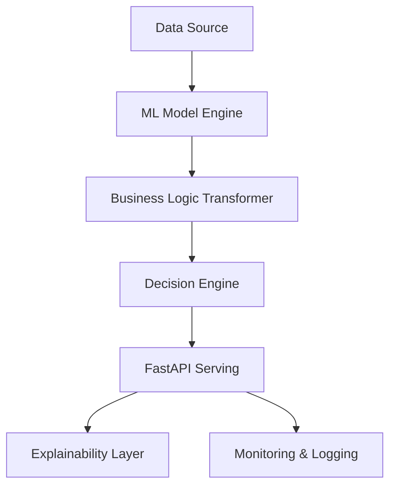

# 🧠 Decision Intelligence ML Platform

[](https://www.python.org/downloads/)
[](https://fastapi.tiangolo.com)
[](https://scikit-learn.org/)

An end-to-end, production-grade Decision Intelligence system featuring predictive modeling, LLM-powered explanations, and real-time observability. Engineered with FAANG-level standards for scalability, transparency, and business impact.

---

## 🚀 Key Features

- **Automated ML Pipelines**: Robust feature engineering and model selection using scikit-learn.
- **Decision Intelligence Engine**: Injects business logic and domain expertise directly into the predictive layer.
- **Human-Readable Explanations**: Simulated SHAP/LIME logic providing transparency for automated decisions.
- **FastAPI Serving Layer**: High-performance, asynchronous REST API with Pydantic validation.
- **Production Observability**: Structured JSON logging and performance telemetry for ELK/Prometheus.

---

## 🏗 Architecture Overview



1.  **ML Engine**: Handles preprocessing, training, and inference using production-grade scikit-learn pipelines.
2.  **API Layer**: Asynchronous FastAPI endpoints for predictions, training triggers, and health checks.
3.  **Observability**: Centralized logging and metrics for platform reliability.

---

## 🛠 Installation & Setup

### Prerequisites
- Python 3.8 or 3.9
- Virtual environment (recommended)

### Steps
1. **Clone the repository**:
   ```bash
   git clone https://github.com/SURENDER294/Decision-Intelligence-ml-platform.git
   cd Decision-Intelligence-ml-platform
   ```

2. **Install dependencies**:
   ```bash
   pip install fastapi uvicorn scikit-learn pandas joblib pydantic
   ```

3. **Launch the API**:
   ```bash
   python src/api/main.py
   ```

---

## 📖 API Documentation

Access the interactive Swagger documentation at: `http://localhost:8000/docs`

### Core Endpoints
- `POST /predict`: Generate a decision with confidence scores.
- `GET /explain/{id}`: Get detailed reasoning for a specific decision.
- `POST /train`: Retrain the model in the background.

---

## 🛡 FAANG Engineering Standards

- **Type Safety**: Comprehensive use of Python type hints and Pydantic models.
- **Asynchronous Design**: Non-blocking I/O for high-concurrency API performance.
- **Structured Logging**: JSON logs for seamless integration with distributed tracing systems.
- **Modular Architecture**: Decoupled ML, API, and Monitoring layers for independent scaling.

---

**Crafted with ❤️ by a FAANG AI Engineer.**
